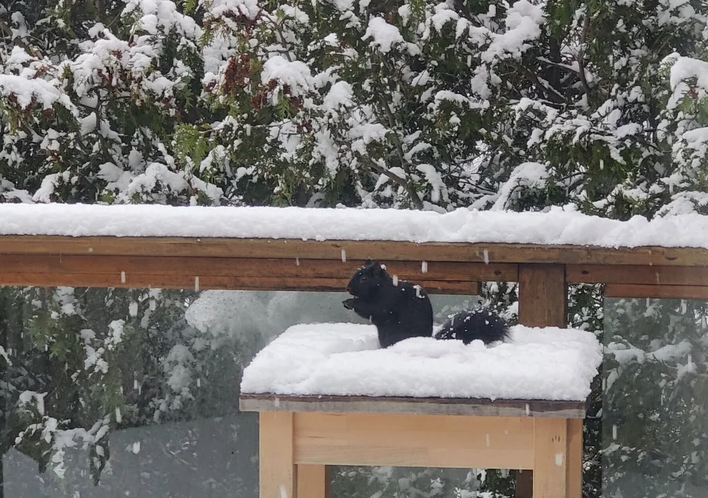
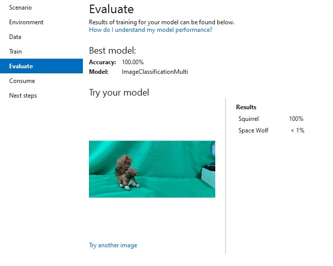
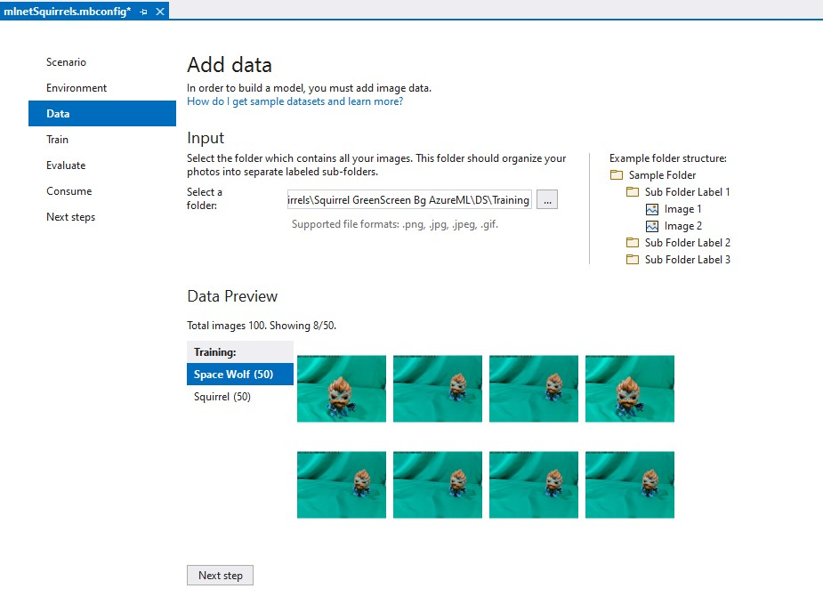
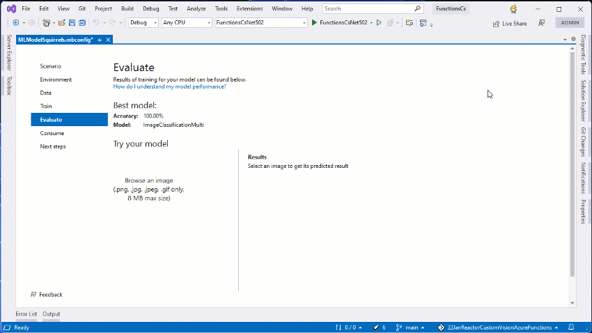
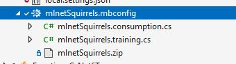
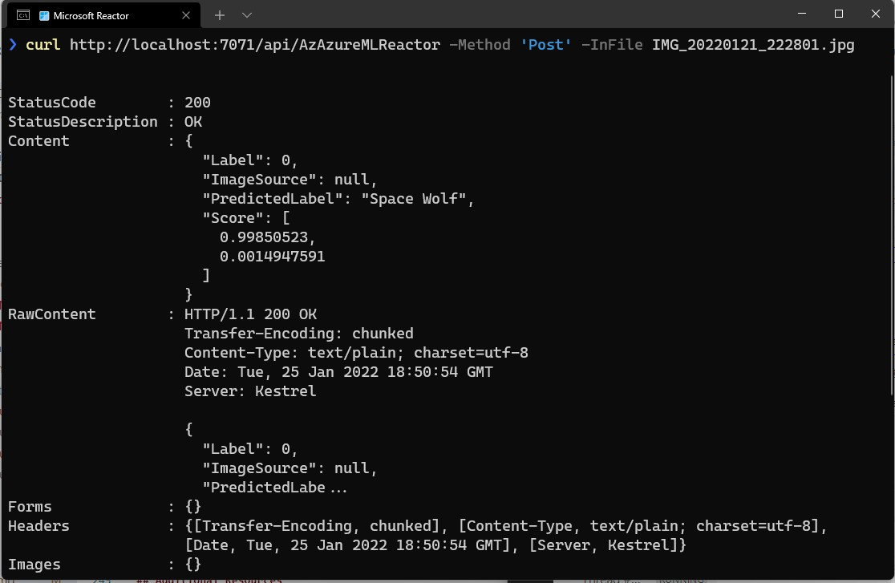
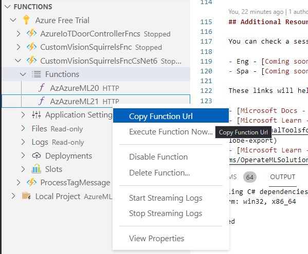

# Vision recognition using Azure Machine Learning and Azure Functions

[](/LICENSE)
[](https://twitter.com/kartben)


During the last couple of months, I’ve having fun with my new friends at home: 🐿️🐿️🐿️. These little ones, are extremelly funny, and they literally don’t care about the cold 🥶❄️☃️.

[](squirrell-on-the-snow.png)

So, I decided to help them and build an Automatic Feeder using Azure IoT, a Wio Terminal and maybe some more devices. You can check the Azure IoT project here [Azure IoT - Squirrel Feeder](https://aka.ms/AzureIoTSquirrelFeederGitHub).

Once the feeder was ready, I decided to add a new feature to the scenario, detecting when a squirrel 🐿️ is nearby the feeder. In this repository I'll share:

- How to create an image recognition model using [Azure Machine Learning](https://aka.ms/WhatisAzureML-ci).
- How to export the model to a ML.Net image format.
- How to run the model in an Azure Function.

[](testmodel.jpg)

## Azure Machine Learning

[Azure Machine Learning](https://aka.ms/WhatisAzureML-ci) is a cloud service for accelerating and managing the machine learning project lifecycle. Machine learning professionals, data scientists, and engineers can use it in their day-to-day workflows: Train and deploy models, and manage MLOps.

You can create a model in Azure Machine Learning or use a model built from an open-source platform, such as Pytorch, TensorFlow, or scikit-learn. MLOps tools help you monitor, retrain, and redeploy models.

## ML.NET

ML.NET gives you the ability to add machine learning to .NET applications, in either online or offline scenarios. With this capability, you can make automatic predictions using the data available to your application. Machine learning applications make use of patterns in the data to make predictions rather than needing to be explicitly programmed.

Central to ML.NET is a machine learning model. The model specifies the steps needed to transform your input data into a prediction. With ML.NET, you can train a custom model by specifying an algorithm, or you can import pre-trained TensorFlow and ONNX models.

Once you have a model, you can add it to your application to make the predictions.

ML.NET runs on Windows, Linux, and macOS using .NET Core, or Windows using .NET Framework. 64 bit is supported on all platforms. 32 bit is supported on Windows, except for TensorFlow, LightGBM, and ONNX-related functionality.

For this scenario we will use ML.Net to create an image recognition model. This model will be trained on a dataset of images of squirrels 🐿️. The Tutorial - [Train an image classification model in Azure using Model Builder](https://docs.microsoft.com/dotnet/machine-learning/tutorials/image-classification-model-builder) describes the necesary steps to create a model.

Once you select the **Image Classification** scenario, you can use the images in the "[AzureML/Train/](AzureML/Train/)" directory in this repository to train your model.



Here is the model performing live recognition in action: 




## Exporting the model to ML.Net

Once the project  was trained, you can export it to several formats. ML.Net supports exporting to popular formats, such as ONNX. For this scenario we will use the standard ZIP file that represent our model.




Once we train a model using Model Builder, we can find the following files:

- `mlnetSquirrels.mbconfig`. This file represents the model configuration.
- `mlnetSquirrels.zip`. This file represents the generated model.
- `mlnetSquirrels.consumption.cs`. This file include classes to work with the model. Including Model Input, Model Output, and Model Predictor.
- `mlnetSquirrels.training.cs`. This file include classes to retrain the model.

The following C# code, is a sample of how to use the model:

```csharp
//Load sample data
var imageBytes = File.ReadAllBytes(@"C:\testdata\Space Wolf\test01.jpg");
MlnetSquirrels.ModelInput sampleData = new MlnetSquirrels.ModelInput()
{
    ImageSource = imageBytes,
};

//Load model and predict output
var result = MlnetSquirrels.Predict(sampleData);
```

## Azure Function

Time to code! Let's create a new Azure Function Using [Visual Studio Code](https://code.visualstudio.com/) and the [Azure Functions for Visual Studio Code](https://marketplace.visualstudio.com/items?itemName=ms-azuretools.vscode-azurefunctions) extension. For this specific scenario we will create a C# function that will run the model and return the result.

Inside the Azure Function folder, let's copy the generated model files:
- `mlnetSquirrels.zip`. This file represents the generated model.
- `mlnetSquirrels.consumption.cs`. This file include classes to work with the model. Including Model Input, Model Output, and Model Predictor.

**Note:** `mlnetSquirrels.training.cs` and `mlnetSquirrels.mbconfig` files are not necessary.


### Changes to `Function1.cs`
The following code is the final code for the generated `Function1.cs` file in the Azure Function. 
A couple of notes:

- The function will receive a POST request with the file bytes in the body.
- The function will return a JSON object with the prediction result.
- The function will process the BODY content as an byte array and will use the Model Input class to create a Model Input object.
- The function will use the Model Predictor class to make the prediction.


```csharp
using System;
using System.IO;
using System.Threading.Tasks;
using Microsoft.AspNetCore.Mvc;
using Microsoft.Azure.WebJobs;
using Microsoft.Azure.WebJobs.Extensions.Http;
using Microsoft.AspNetCore.Http;
using Microsoft.Extensions.Logging;
using Newtonsoft.Json;

namespace FunctionsCsNet6
{
    public static class AzAzureML21
    {
        [FunctionName("AzAzureML21")]
        public static async Task<IActionResult> Run(
            [HttpTrigger(AuthorizationLevel.Function, "get", "post", Route = null)] HttpRequest req,
            ILogger log)
        {
            log.LogInformation("C# HTTP trigger function processed a request.");

            var predictionResult = new MlnetSquirrels.ModelOutput();
            predictionResult.Label = 0;
            predictionResult.PredictedLabel = "not processed";
            predictionResult.ImageSource = null;
            predictionResult.Score = new float[2];
            predictionResult.Score[0] = 0;
            predictionResult.Score[1] = 0;

            try
            {

                log.LogInformation($"ML.NET model loaded from {MlnetSquirrels.GetModelPath()}");

                using var imageInStream = new MemoryStream();
                req.Body.CopyTo(imageInStream);

                // var imageBytes = File.ReadAllBytes(imagePath);
                var imageBytes = imageInStream.ToArray();
                var sampleData = new MlnetSquirrels.ModelInput()
                {
                    ImageSource = imageBytes,
                };
                // Make a single prediction on the sample data and print results
                predictionResult = MlnetSquirrels.Predict(sampleData);
                var logData = $"\n\nPredicted Label value: {predictionResult.PredictedLabel} \nPredicted Label scores: [{string.Join(",", predictionResult.Score)}]\n\n";
                log.LogInformation(logData);

                predictionResult.ImageSource = null;
            }
            catch (Exception ex)
            {
                var message = $"Exc: " + ex.Message;
                predictionResult.PredictedLabel = message;
            }

            var result = JsonConvert.SerializeObject(predictionResult, Formatting.Indented);

            return new OkObjectResult(result);
        }
    }
} 
```

### Changes to `mlnetSquirrels.consumption.cs`
The following code is the final code for the `mlnetSquirrels.consumption.cs` file in the Azure Function. This is necesary to load the model in non-Windows environments.

```csharp
public static string GetModelPath()
{
    var modelName = "mlnetSquirrels.zip";
    string currentAssemblyPath = Path.GetDirectoryName(System.Reflection.Assembly.GetExecutingAssembly().Location);
    var modelPath = Path.Combine(currentAssemblyPath, modelName);

    // check if model exists
    if (!File.Exists(modelPath))
    {
        // get parent directory from current assembly path
        var parentDirectory = Directory.GetParent(currentAssemblyPath).ToString();                               
        modelPath = Path.Combine(parentDirectory, modelName);
    }

    Console.WriteLine($"Model path: {modelPath}");

    return modelPath;
}

private static PredictionEngine<ModelInput, ModelOutput> CreatePredictEngine()
{
    var mlContext = new MLContext();
    var modelPath = GetModelPath();
    ITransformer mlModel = mlContext.Model.Load(modelPath, out var _);
    return mlContext.Model.CreatePredictionEngine<ModelInput, ModelOutput>(mlModel);
} 
```

### Changes to `AzureFunctionProject.csproj`
The project will require the following NuGet packages:

- Microsoft.ML
- Microsoft.ML.Vision" Version
- Microsoft.NET.Sdk.Functions
- SciSharp.TensorFlow.Redist

The following code describes the packages and current versions in the CSProj file:

```xml
<PackageReference Include="Microsoft.ML" Version="1.7.0" />
<PackageReference Include="Microsoft.ML.Vision" Version="1.7.0" />
<PackageReference Include="Microsoft.NET.Sdk.Functions" Version="4.0.1" />
<PackageReference Include="SciSharp.TensorFlow.Redist" Version="2.3.1" />
```

### Sample Code

You can view a sample function completed code in the "[AzureFunction/AzureMLSquirrelDetectorFunction/](AzureFunction/AzureMLSquirrelDetectorFunction/)" directory in this repository.


## Testing the sample

Once our code is complete we can test the sample in local mode or in Azure Functions, after we deploy the Function. In both scenarios we can use any tool or language that can perform HTTP POST requests to the Azure Function to test our function.

### Test using Curl

Curl is a command line tool that allows you to send HTTP requests to a server. It is a very simple tool that can be used to send HTTP requests to a server. We can test the local function using curl with the following command:

```bash
❯ curl http://localhost:7071/api/AzAzureMLReactor -Method 'Post' -InFile <test_file.jpg>
```



### Test using Postman

**Postman** is a great tool to test our function. You can use it to test the function in local mode and also to test the function once it has been deployed to Azure Functions. You can download Postman [here](https://www.postman.com/downloads/).

In order to test our function we need to know the function url. In Visual Studio Code, we can get the url by clicking on the Functions section in the Azure Extension. Then we can right click on the function and select "Copy Function URL".



Now we can go to Postman and create a new POST request using our function url. We can also add the image we want to test. Here is a live demo, with the function running locally, in Debug mode in Visual Studio Code:


We are now ready to test our function in Azure Functions. To do so we need to deploy the function to Azure Functions. And use the new Azure Function url with the same test steps. 


## Additional Resources

You can check a session recording about this topic in English and Spanish.

- Eng - [Coming soon](https://aka.ms/ServerlesssinJan1.25)
- Spa - [Coming soon](https://aka.ms/ServerlesssinJan1.11)

These links will help to understand specific implementations of the sample code:

- [Microsoft Docs - Azure Machine Learning](https://aka.ms/WhatisAzureML-ci)
- [Microsoft Learn - Microsoft Azure AI Fundamentals: Explore visual tools for machine learning](https://aka.ms/VisualToolsforML-ci)
lobe-export)
- [Microsoft Learn - Build and operate machine learning solutions with Azure Machine Learning](https://aka.ms/OperateMLSolutions-ci)
- [Microsoft Docs - What is ML.NET and how does it work?](https://docs.microsoft.com/dotnet/machine-learning/how-does-mldotnet-work)
- [Microsoft Docs - Train an image classification model in Azure using Model Builder](https://docs.microsoft.com/dotnet/machine-learning/tutorials/image-classification-model-builder)
- [Microsoft Learn - Create serverless applications](https://aka.ms/CreateServerlessApps-ci)
- [Microsoft Docs - AZ-204: Implement Azure Functions](https://aka.ms/AzureFunctions-ci)
- [Microsoft Learn - Connect your services together](https://aka.ms/ConnectServicesTogether-ci)

In my personal blog "[ElBruno.com](https://elbruno.com)", I wrote about several scenarios on how to work and code with [LOBE](https://elbruno.com/tag/lobe/). 

- [How to create a dataset with images to be used on the AzureML Designer using the DenseNet template](https://elbruno.com/2022/01/24/azureml-how-to-create-a-dataset-with-images-to-be-used-on-the-azureml-designer-densenet-samples/)
- [Using a custom images 🖼️ dataset on the AzureML Designer using the DenseNet template 🎨](https://elbruno.com/2022/01/25/azureml-using-a-custo-images-%f0%9f%96%bc%ef%b8%8f-dataset-on-the-azureml-designer-densenet-template-%f0%9f%8e%a8/)

## Author

👤 **Bruno Capuano**

* Website: https://elbruno.com
* Twitter: [@elbruno](https://twitter.com/elbruno)
* Github: [@elbruno](https://github.com/elbruno)
* LinkedIn: [@elbruno](https://linkedin.com/in/elbruno)

## 🤝 Contributing

Contributions, issues and feature requests are welcome!

Feel free to check [issues page](https://github.com/elbruno/AzureMLAndAzureFunctions/issues).

## Show your support

Give a ⭐️ if this project helped you!


## 📝 License

Copyright &copy; 2021 [Bruno Capuano](https://github.com/elbruno).

This project is [MIT](/LICENSE) licensed.

***